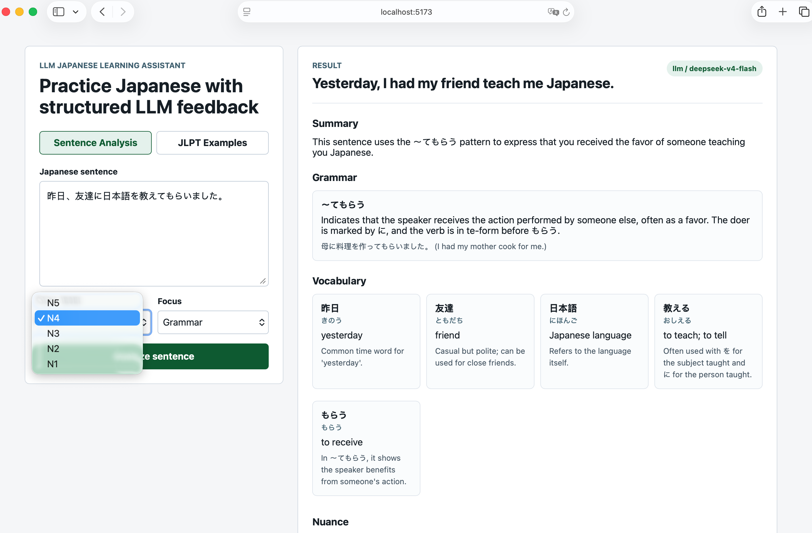
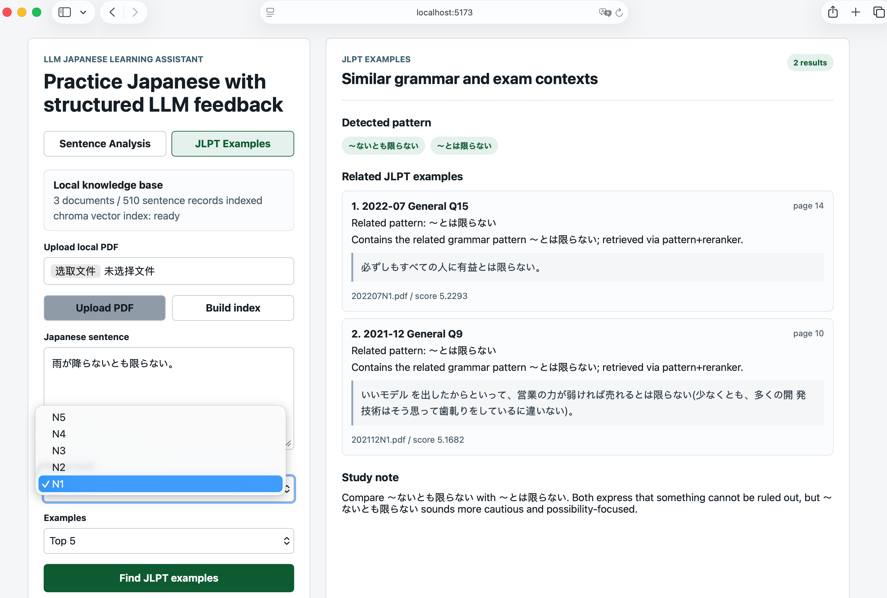

# LLM Japanese Learning Assistant

A Japanese learning assistant for sentence analysis and JLPT example retrieval.

This project started as an LLM-powered Japanese sentence analyzer, but it is no longer just a model API wrapper. It now includes a local RAG pipeline that lets users build a private JLPT knowledge base from their own PDFs, retrieve related exam examples, and compare grammar usage in real contexts.

The app is designed for Japanese learners who want structured explanations, and for LLM engineering practice around API integration, retrieval, local vector indexing, and reranking.

## Screenshots

### Sentence Analysis

Analyze a Japanese sentence with grammar notes, vocabulary, nuance, examples, and practice questions.



### JLPT Examples

Search related JLPT examples from a local RAG knowledge base built from user-provided PDFs.



## Features

- Analyze Japanese sentences by JLPT level
- Explain grammar patterns, vocabulary, nuance, and usage
- Generate example sentences and practice questions
- Upload local JLPT PDFs and build a private knowledge base
- Retrieve related JLPT examples with a Chroma-based RAG pipeline
- Use multilingual sentence embeddings for semantic retrieval
- Use a CrossEncoder reranker to improve retrieved example ranking
- Keep local PDFs, uploads, and vector indexes out of Git
- Connect to DeepSeek or another OpenAI-compatible chat API
- Run in mock mode for UI and API testing without a model key

## Why Local RAG

JLPT past papers and related exam materials are copyrighted. For that reason, this repository does not include any JLPT PDF files or extracted exam content.

Instead, the app provides the tooling for users to build their own local knowledge base:

1. Place text-based JLPT PDFs under `knowledge_base/raw/`, or upload PDFs from the frontend.
2. Build the local index.
3. The backend extracts sentence-level records from the PDFs.
4. Sentence records are embedded with a multilingual embedding model.
5. Embeddings are stored in a local Chroma vector database.
6. Queries retrieve semantic candidates and rerank them with a CrossEncoder.
7. The frontend displays short related examples with source metadata.

This keeps copyrighted materials private while still making the project useful as a real RAG application.

## RAG Pipeline

```text
User sentence
  -> grammar pattern extraction
  -> sentence embedding
  -> Chroma vector search
  -> grammar-aware filtering
  -> CrossEncoder reranking
  -> related JLPT examples
```

The retrieval system also has a lightweight fallback. If Chroma or the embedding models are not available yet, the backend can still run with local sentence-vector matching, so the app does not fail during first-time setup.

## Tech Stack

- Backend: Python, FastAPI, Pydantic, httpx
- Frontend: Vue 3, TypeScript, Vite
- LLM API: OpenAI-compatible chat completions, tested with DeepSeek
- RAG: Chroma, sentence-transformers, multilingual embeddings, CrossEncoder reranking
- PDF processing: pypdf
- DevOps: Docker Compose

## Quick Start

Clone the repository and start the backend:

```bash
cd backend
python -m venv .venv
source .venv/bin/activate
pip install -r requirements.txt
cp .env.example .env
uvicorn app.main:app --reload --port 8000
```

Start the frontend in another terminal:

```bash
cd frontend
npm install
npm run dev
```

Open:

```text
http://localhost:5173
```

Backend health check:

```text
http://localhost:8000/health
```

## Configuration

Create `backend/.env` from `backend/.env.example`.

### Mock Mode

Use mock mode when you only want to test the UI and API flow:

```env
LLM_PROVIDER=mock
LLM_API_KEY=
LLM_BASE_URL=https://api.openai.com/v1
LLM_MODEL=gpt-4.1-mini
```

### DeepSeek

Use DeepSeek with the OpenAI-compatible endpoint:

```env
LLM_PROVIDER=openai_compatible
LLM_API_KEY=your_deepseek_api_key_here
LLM_BASE_URL=https://api.deepseek.com
LLM_MODEL=deepseek-v4-flash
```

For stronger reasoning:

```env
LLM_PROVIDER=openai_compatible
LLM_API_KEY=your_deepseek_api_key_here
LLM_BASE_URL=https://api.deepseek.com
LLM_MODEL=deepseek-v4-pro
LLM_THINKING_TYPE=enabled
LLM_REASONING_EFFORT=high
```

Runtime configuration is loaded from `backend/.env`.

### Local RAG

The local knowledge-base search uses Chroma by default:

```env
RAG_VECTOR_BACKEND=chroma
RAG_EMBEDDING_MODEL=intfloat/multilingual-e5-small
RAG_RERANKER_MODEL=cross-encoder/mmarco-mMiniLMv2-L12-H384-v1
RAG_USE_RERANKER=true
RAG_RETRIEVAL_K=30
```

The first indexing run downloads the embedding and reranker models. Later runs can reuse the local model cache.

## Build A Local JLPT Knowledge Base

Put your own text-based JLPT PDFs under:

```text
knowledge_base/raw/
```

Then build the local index from the frontend, or use:

```bash
curl -X POST http://localhost:8000/api/knowledge/ingest
```

Find related JLPT examples:

```bash
curl -X POST http://localhost:8000/api/knowledge/related \
  -H "Content-Type: application/json" \
  -d '{
    "sentence": "雨が降らないとも限らない。",
    "jlpt_level": "N1",
    "top_k": 5
  }'
```

Local PDFs, uploads, Chroma data, and generated retrieval indexes are ignored by Git:

```text
knowledge_base/raw/
knowledge_base/uploads/
knowledge_base/index/
```

## Sentence Analysis API

Analyze a Japanese sentence:

```bash
curl -X POST http://localhost:8000/api/analyze \
  -H "Content-Type: application/json" \
  -d '{
    "sentence": "今日は雨が降っています。",
    "jlpt_level": "N5",
    "focus": "grammar"
  }'
```

Response fields:

```text
summary
natural_translation
grammar_points
vocabulary
nuance
examples
practice_questions
model_used
source
```

`source` is `mock` in mock mode and `llm` when a real model API is used.

## Project Structure

```text
backend/
  app/
    main.py
    schemas.py
    services/
      llm_service.py
      knowledge_service.py
      prompt_builder.py
  requirements.txt
  .env.example

frontend/
  src/
    App.vue
    main.ts
    styles.css
  package.json
  vite.config.ts

assets/
  demo1.png
  demo2.png

docker-compose.yml
```

## Docker

```bash
docker compose up
```

The frontend runs on `http://localhost:5173` and the backend runs on `http://localhost:8000`.

## Notes

- This repository does not provide JLPT PDFs or extracted copyrighted exam content.
- Users are responsible for preparing their own local PDFs.
- The local knowledge base is intended for private study and local experimentation.
- Local API configuration and knowledge-base files are excluded from the repository.

## Roadmap

- Add answer synthesis over retrieved JLPT examples
- Add saved sentence history
- Add source-page preview for retrieved PDF examples
- Add evaluation scripts for retrieval quality
