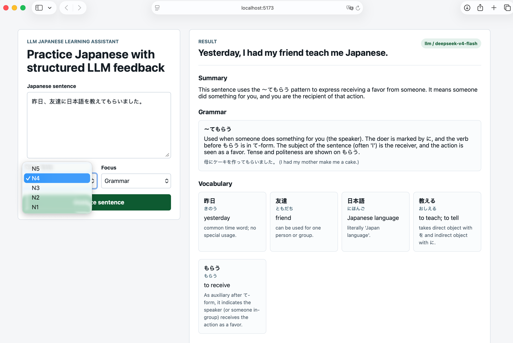

# LLM Japanese Learning Assistant

An LLM-powered Japanese learning assistant that explains Japanese sentences with grammar notes, vocabulary, nuance, examples, and practice questions.

The app includes a FastAPI backend and a Vue 3 frontend. It can run in mock mode without an API key, or connect to any OpenAI-compatible model API such as DeepSeek.

## Demo



## Features

- Analyze Japanese sentences by JLPT level
- Explain grammar patterns, vocabulary, and nuance
- Generate example sentences and practice questions
- Find related N1 examples with a local sentence-level RAG pipeline
- Upload local PDFs and build a private local retrieval index
- Support focus modes: general, grammar, vocabulary, nuance, and exam
- Use mock mode for local UI testing
- Connect to DeepSeek or another OpenAI-compatible chat API

## Stack

- Backend: Python, FastAPI, Pydantic, httpx
- Frontend: Vue 3, TypeScript, Vite
- Knowledge base: local PDF extraction, sentence-level indexing, and RAG retrieval
- Model API: OpenAI-compatible chat completions
- DevOps: Docker Compose

## Quick Start

Clone the repository and start the backend:

```bash
cd backend
python -m venv .venv
source .venv/bin/activate
pip install -r requirements.txt
cp .env.example .env
uvicorn app.main:app --reload --port 8000
```

Start the frontend in another terminal:

```bash
cd frontend
npm install
npm run dev
```

Open:

```text
http://localhost:5173
```

Backend health check:

```text
http://localhost:8000/health
```

## Configuration

Create `backend/.env` from `backend/.env.example`.

### Mock Mode

Use mock mode when you only want to test the UI and API flow:

```env
LLM_PROVIDER=mock
LLM_API_KEY=
LLM_BASE_URL=https://api.openai.com/v1
LLM_MODEL=gpt-4.1-mini
```

### DeepSeek

Use DeepSeek with the OpenAI-compatible endpoint:

```env
LLM_PROVIDER=openai_compatible
LLM_API_KEY=your_deepseek_api_key_here
LLM_BASE_URL=https://api.deepseek.com
LLM_MODEL=deepseek-v4-flash
```

For stronger reasoning:

```env
LLM_PROVIDER=openai_compatible
LLM_API_KEY=your_deepseek_api_key_here
LLM_BASE_URL=https://api.deepseek.com
LLM_MODEL=deepseek-v4-pro
LLM_THINKING_TYPE=enabled
LLM_REASONING_EFFORT=high
```

Do not commit `backend/.env`. It is ignored by Git.

## API

Analyze a Japanese sentence:

```bash
curl -X POST http://localhost:8000/api/analyze \
  -H "Content-Type: application/json" \
  -d '{
    "sentence": "今日は雨が降っています。",
    "jlpt_level": "N5",
    "focus": "grammar"
  }'
```

Response fields:

```text
summary
natural_translation
grammar_points
vocabulary
nuance
examples
practice_questions
model_used
source
```

`source` is `mock` in mock mode and `llm` when a real model API is used.

## Local RAG Knowledge Base

The app can search local JLPT PDFs without committing them to GitHub. During ingestion, PDFs are converted into sentence-level records with local text vectors. At query time, the system extracts grammar patterns, retrieves matching sentence records, reranks the candidates, and returns short examples with source metadata.

Put text-based PDFs under:

```text
knowledge_base/raw/
```

Then build the local index from the frontend or with:

```bash
curl -X POST http://localhost:8000/api/knowledge/ingest
```

Find related N1 examples:

```bash
curl -X POST http://localhost:8000/api/knowledge/related \
  -H "Content-Type: application/json" \
  -d '{
    "sentence": "雨が降らないとも限らない。",
    "jlpt_level": "N1",
    "top_k": 5
  }'
```

Local PDFs, uploads, and generated retrieval indexes are ignored by Git:

```text
knowledge_base/raw/
knowledge_base/uploads/
knowledge_base/index/
```

## Project Structure

```text
backend/
  app/
    main.py
    schemas.py
    services/
      llm_service.py
      knowledge_service.py
      prompt_builder.py
  requirements.txt
  .env.example

frontend/
  src/
    App.vue
    main.ts
    styles.css
  package.json
  vite.config.ts

docker-compose.yml
```

## Docker

```bash
docker compose up
```

The frontend runs on `http://localhost:5173` and the backend runs on `http://localhost:8000`.

## Roadmap

- Add semantic embeddings with FAISS or Chroma
- Add LLM-based reranking for difficult grammar variants
- Add saved sentence history
- Add answer quality evaluation
